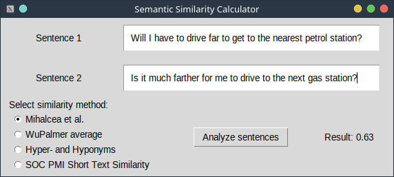

# NLP Course 2023 Project 23: Semantic Similarity 2

## Introduction

This project was carried on for the 2023 course in Natural Language Processing and Text Mining at the University of
Oulu.
The chosen track is Project 23: Semantic Similarity 2.

The goal was to implement and utilize four different methods to calculate the semantic similarity between sentences,
evaluate them with an existing dataset, and create a GUI that allows the user to calculate the similarity between two
input sentences with any chosen method out of the four implemented ones.

## Installation

The project is implemented in Python3. A working installation of the language is necessary.
We suggest creating a virtual environment to install this project's requirements. With the `venv` module installed you
can execute `python -m venv <path_to_env_folder>` to create it. You can then activate it
with `source <venv_folder>/bin/activate` on Bash; please lookup instructions for other shells and operating systems.

After activating the environment, you can install the requirements for the project by
executing `pip install -r requirements.txt` from the project's root folder.
The requirements are:

|   Library    | Version |
|:------------:|:-------:|
|     nltk     |  3.8.1  |
|    pandas    |  2.1.2  |
| scikit_learn |  1.3.1  |
|    scipy     | 1.11.3  |
|    spacy     |  3.7.2  |

## Usage

The project contains two scripts that are intended for direct execution: `validator.py` and `gui.py`. These can be
executed with `python <script>`.

The first script reads all sentence pairs from `stss-131.csv`, feeds them to the four methods and computes the Pearson
coefficient between the ground truth values in the dataset and the ones calculated by each method. The four methods are,
ordered from 1 to 4:

- Mihalcea et al. with WordNet similarity, proposed in "Mihalcea, Rada & Corley, Courtney & Strapparava, Carlo. (2006).
  Corpus-based and Knowledge-based Measures of Text Semantic Similarity.. Proceedings of the National Conference on
  Artificial Intelligence. 1.";

- Average of Wu-Palmer similarity between all pairs of words from the two different sentences;

- Average of the maximum Jaccard similarity between the sets of hypernyms of all pairs of nouns from the two different
  sentences, and the maximum Jaccard similarity between the sets of hyponyms of all pairs of verbs from the two
  different sentences;

- Method proposed in "Islam, Aminul & Inkpen, Diana. (2008). Semantic Text Similarity Using Corpus-Based Word Similarity
  and String Similarity. TKDD. 2. 10.1145/1376815.1376819.", with implementation already provided
  in https://github.com/pritishyuvraj/SOC-PMI-Short-Text-Similarity-.

For each method, the Pearson coefficient is printed.

The second script opens a desktop window with two text fields, where sentences are written in, and a multiple choice
field that is used to pick the method. When the button is clicked, the calculated similarity score will be shown to the
user.

